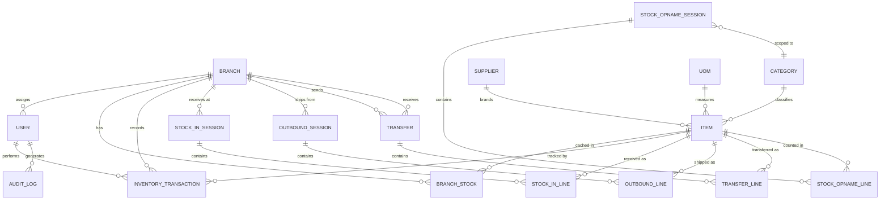
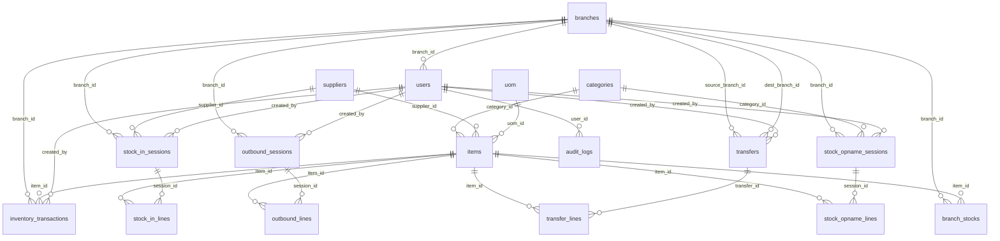
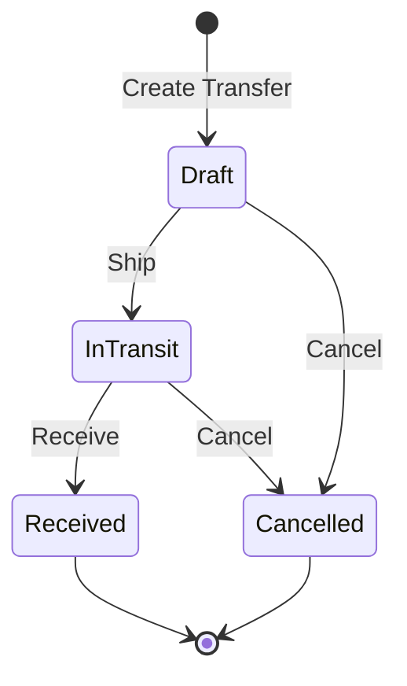

# Architecture — Gudang Piala Kaltim WMS

Technical architecture document. Read PROJECT.md for business requirements.

---

## 1. Domain Model



### Entity Summary

| Entity | Scope | Purpose |
|--------|-------|---------|
| Branch | System | Physical warehouse locations |
| User | Per-branch | Operators with role-based access |
| Category | Global | Item classification with code prefix |
| Supplier | Global | Brand and supplier identity |
| UOM | Global | Unit of measure lookup |
| Item | Global | Inventory component catalog |
| InventoryTransaction | Per-branch | Immutable ledger (source of truth) |
| BranchStock | Per-branch | Cached stock quantities (read optimization) |
| StockInSession / Line | Per-branch | Batch goods receiving |
| OutboundSession / Line | Per-branch | Cart-based outbound shipments |
| Transfer / TransferLine | Cross-branch | Inter-branch stock movement |
| StockOpnameSession / Line | Per-branch | Physical count reconciliation |
| AuditLog | System | Immutable action history |

---

## 2. Complete Database Schema

All tables follow PostgreSQL conventions from the postgresql skill:

- `BIGINT GENERATED ALWAYS AS IDENTITY` for primary keys
- `TIMESTAMPTZ` for all timestamps (never `TIMESTAMP`)
- `TEXT` for all strings (never `VARCHAR(n)` or `CHAR(n)`)
- `TEXT + CHECK` for business enums (not `CREATE TYPE ... AS ENUM`)
- `NOT NULL` everywhere semantically required
- `snake_case` for all identifiers
- Manual indexes on all FK columns

### branches

```sql
CREATE TABLE branches (
    branch_id   BIGINT GENERATED ALWAYS AS IDENTITY PRIMARY KEY,
    name        TEXT NOT NULL UNIQUE,
    address     TEXT,
    is_active   BOOLEAN NOT NULL DEFAULT true,
    created_at  TIMESTAMPTZ NOT NULL DEFAULT now(),
    updated_at  TIMESTAMPTZ NOT NULL DEFAULT now()
);
```

### users

```sql
CREATE TABLE users (
    user_id       BIGINT GENERATED ALWAYS AS IDENTITY PRIMARY KEY,
    username      TEXT NOT NULL,
    password_hash TEXT NOT NULL,
    full_name     TEXT NOT NULL,
    role          TEXT NOT NULL CHECK (role IN ('super_admin', 'branch_head', 'warehouse_staff')),
    branch_id     BIGINT REFERENCES branches(branch_id) ON DELETE RESTRICT,
    token_version INTEGER NOT NULL DEFAULT 1,
    is_active     BOOLEAN NOT NULL DEFAULT true,
    created_at    TIMESTAMPTZ NOT NULL DEFAULT now(),
    updated_at    TIMESTAMPTZ NOT NULL DEFAULT now()
);

-- case-insensitive username uniqueness
CREATE UNIQUE INDEX idx_users_username_lower ON users (LOWER(username));

-- super_admin may have NULL branch_id (system-wide access)
-- branch_head and warehouse_staff must have a branch_id
ALTER TABLE users ADD CONSTRAINT chk_user_branch
    CHECK (role = 'super_admin' OR branch_id IS NOT NULL);

CREATE INDEX idx_users_branch_id ON users (branch_id);
CREATE INDEX idx_users_role ON users (role);
```

### categories

```sql
CREATE TABLE categories (
    category_id  BIGINT GENERATED ALWAYS AS IDENTITY PRIMARY KEY,
    name         TEXT NOT NULL UNIQUE,
    code_prefix  TEXT NOT NULL UNIQUE,
    is_active    BOOLEAN NOT NULL DEFAULT true,
    created_at   TIMESTAMPTZ NOT NULL DEFAULT now(),
    updated_at   TIMESTAMPTZ NOT NULL DEFAULT now()
);

-- code_prefix examples: MRM, AKR, FIG, STL, ONX, ETG, RSN
-- Must be uppercase alphanumeric, 2-5 characters
ALTER TABLE categories ADD CONSTRAINT chk_category_prefix
    CHECK (code_prefix ~ '^[A-Z0-9]{2,5}$');
```

### suppliers

```sql
CREATE TABLE suppliers (
    supplier_id    BIGINT GENERATED ALWAYS AS IDENTITY PRIMARY KEY,
    name           TEXT NOT NULL UNIQUE,
    code_prefix    TEXT NOT NULL UNIQUE,
    contact_person TEXT,
    phone          TEXT,
    notes          TEXT,
    is_active      BOOLEAN NOT NULL DEFAULT true,
    created_at     TIMESTAMPTZ NOT NULL DEFAULT now(),
    updated_at     TIMESTAMPTZ NOT NULL DEFAULT now()
);

-- code_prefix examples: ONX, FT, IMP
-- Used in item code generation
ALTER TABLE suppliers ADD CONSTRAINT chk_supplier_prefix
    CHECK (code_prefix ~ '^[A-Z0-9]{2,5}$');
```

### uom (units of measure)

```sql
CREATE TABLE uom (
    uom_id     BIGINT GENERATED ALWAYS AS IDENTITY PRIMARY KEY,
    name       TEXT NOT NULL UNIQUE,
    created_at TIMESTAMPTZ NOT NULL DEFAULT now()
);

-- Seeded with: pcs, lembar, meter, kg, roll, set, unit, box, lusin, pak
```

### items

```sql
CREATE TABLE items (
    item_id       BIGINT GENERATED ALWAYS AS IDENTITY PRIMARY KEY,
    item_code     TEXT NOT NULL UNIQUE,
    name          TEXT NOT NULL,
    category_id   BIGINT NOT NULL REFERENCES categories(category_id) ON DELETE RESTRICT,
    supplier_id   BIGINT NOT NULL REFERENCES suppliers(supplier_id) ON DELETE RESTRICT,
    uom_id        BIGINT NOT NULL REFERENCES uom(uom_id) ON DELETE RESTRICT,
    minimum_stock INTEGER NOT NULL DEFAULT 0 CHECK (minimum_stock >= 0),
    image_url     TEXT,
    is_active     BOOLEAN NOT NULL DEFAULT true,
    created_at    TIMESTAMPTZ NOT NULL DEFAULT now(),
    updated_at    TIMESTAMPTZ NOT NULL DEFAULT now()
);

-- item_code format: {category_prefix}-{supplier_prefix}-{manual_code}
-- Example: MRM-ONX-001, AKR-FT-123

CREATE INDEX idx_items_category_id ON items (category_id);
CREATE INDEX idx_items_supplier_id ON items (supplier_id);
CREATE INDEX idx_items_uom_id ON items (uom_id);
CREATE INDEX idx_items_is_active ON items (is_active) WHERE is_active = true;
```

### inventory_transactions (immutable ledger — source of truth)

```sql
CREATE TABLE inventory_transactions (
    transaction_id   BIGINT GENERATED ALWAYS AS IDENTITY PRIMARY KEY,
    item_id          BIGINT NOT NULL REFERENCES items(item_id) ON DELETE RESTRICT,
    branch_id        BIGINT NOT NULL REFERENCES branches(branch_id) ON DELETE RESTRICT,
    transaction_type TEXT NOT NULL CHECK (transaction_type IN (
        'IN', 'OUT', 'TRANSFER_OUT', 'TRANSFER_IN',
        'ADJUSTMENT_PLUS', 'ADJUSTMENT_MINUS'
    )),
    quantity         INTEGER NOT NULL CHECK (quantity > 0),
    reference_type   TEXT NOT NULL CHECK (reference_type IN (
        'stock_in', 'outbound', 'transfer', 'opname'
    )),
    reference_id     BIGINT NOT NULL,
    notes            TEXT,
    created_by       BIGINT NOT NULL REFERENCES users(user_id) ON DELETE RESTRICT,
    created_at       TIMESTAMPTZ NOT NULL DEFAULT now()
);

-- This table is append-only. No UPDATE or DELETE operations permitted.
-- Referential integrity to source tables maintained at application level.

-- Primary query patterns:
-- 1. Stock calculation: WHERE item_id = ? AND branch_id = ?
-- 2. Movement history: WHERE item_id = ? ORDER BY created_at
-- 3. Branch activity: WHERE branch_id = ? AND created_at BETWEEN ? AND ?
-- 4. Reference lookup: WHERE reference_type = ? AND reference_id = ?

CREATE INDEX idx_inv_tx_item_branch ON inventory_transactions (item_id, branch_id);
CREATE INDEX idx_inv_tx_branch_created ON inventory_transactions (branch_id, created_at);
CREATE INDEX idx_inv_tx_reference ON inventory_transactions (reference_type, reference_id);
CREATE INDEX idx_inv_tx_created_by ON inventory_transactions (created_by);

-- BRIN index for time-range scans on append-only data
CREATE INDEX idx_inv_tx_created_at_brin ON inventory_transactions
    USING BRIN (created_at);
```

### branch_stocks (read cache)

```sql
CREATE TABLE branch_stocks (
    branch_id  BIGINT NOT NULL REFERENCES branches(branch_id) ON DELETE RESTRICT,
    item_id    BIGINT NOT NULL REFERENCES items(item_id) ON DELETE RESTRICT,
    quantity   INTEGER NOT NULL DEFAULT 0 CHECK (quantity >= 0),
    updated_at TIMESTAMPTZ NOT NULL DEFAULT now(),

    PRIMARY KEY (branch_id, item_id)
);

-- This table is a performance cache. Source of truth is inventory_transactions.
-- Updated synchronously within the same DB transaction as inventory_transactions.
-- The CHECK (quantity >= 0) enforces the no-negative-stock rule at DB level.

CREATE INDEX idx_branch_stocks_item_id ON branch_stocks (item_id);
CREATE INDEX idx_branch_stocks_low_stock ON branch_stocks (quantity)
    WHERE quantity >= 0;
```

### stock_in_sessions / stock_in_lines

```sql
CREATE TABLE stock_in_sessions (
    session_id       BIGINT GENERATED ALWAYS AS IDENTITY PRIMARY KEY,
    branch_id        BIGINT NOT NULL REFERENCES branches(branch_id) ON DELETE RESTRICT,
    reference_number TEXT,
    notes            TEXT,
    created_by       BIGINT NOT NULL REFERENCES users(user_id) ON DELETE RESTRICT,
    created_at       TIMESTAMPTZ NOT NULL DEFAULT now()
);

CREATE INDEX idx_stock_in_sessions_branch ON stock_in_sessions (branch_id);
CREATE INDEX idx_stock_in_sessions_created_by ON stock_in_sessions (created_by);

CREATE TABLE stock_in_lines (
    line_id    BIGINT GENERATED ALWAYS AS IDENTITY PRIMARY KEY,
    session_id BIGINT NOT NULL REFERENCES stock_in_sessions(session_id) ON DELETE CASCADE,
    item_id    BIGINT NOT NULL REFERENCES items(item_id) ON DELETE RESTRICT,
    quantity   INTEGER NOT NULL CHECK (quantity > 0),
    created_at TIMESTAMPTZ NOT NULL DEFAULT now(),
    UNIQUE (session_id, item_id)
);

CREATE INDEX idx_stock_in_lines_session ON stock_in_lines (session_id);
CREATE INDEX idx_stock_in_lines_item ON stock_in_lines (item_id);
```

### outbound_sessions / outbound_lines

```sql
CREATE TABLE outbound_sessions (
    session_id       BIGINT GENERATED ALWAYS AS IDENTITY PRIMARY KEY,
    branch_id        BIGINT NOT NULL REFERENCES branches(branch_id) ON DELETE RESTRICT,
    reference_number TEXT NOT NULL,
    notes            TEXT,
    created_by       BIGINT NOT NULL REFERENCES users(user_id) ON DELETE RESTRICT,
    created_at       TIMESTAMPTZ NOT NULL DEFAULT now()
);

CREATE INDEX idx_outbound_sessions_branch ON outbound_sessions (branch_id);
CREATE INDEX idx_outbound_sessions_created_by ON outbound_sessions (created_by);
CREATE INDEX idx_outbound_sessions_ref ON outbound_sessions (reference_number);

CREATE TABLE outbound_lines (
    line_id    BIGINT GENERATED ALWAYS AS IDENTITY PRIMARY KEY,
    session_id BIGINT NOT NULL REFERENCES outbound_sessions(session_id) ON DELETE CASCADE,
    item_id    BIGINT NOT NULL REFERENCES items(item_id) ON DELETE RESTRICT,
    quantity   INTEGER NOT NULL CHECK (quantity > 0),
    created_at TIMESTAMPTZ NOT NULL DEFAULT now(),
    UNIQUE (session_id, item_id)
);

CREATE INDEX idx_outbound_lines_session ON outbound_lines (session_id);
CREATE INDEX idx_outbound_lines_item ON outbound_lines (item_id);
```

### transfers / transfer_lines

```sql
CREATE TABLE transfers (
    transfer_id        BIGINT GENERATED ALWAYS AS IDENTITY PRIMARY KEY,
    transfer_number    TEXT NOT NULL UNIQUE,
    source_branch_id   BIGINT NOT NULL REFERENCES branches(branch_id) ON DELETE RESTRICT,
    dest_branch_id     BIGINT NOT NULL REFERENCES branches(branch_id) ON DELETE RESTRICT,
    status             TEXT NOT NULL DEFAULT 'draft' CHECK (status IN (
        'draft', 'in_transit', 'received', 'cancelled'
    )),
    notes              TEXT,
    created_by         BIGINT NOT NULL REFERENCES users(user_id) ON DELETE RESTRICT,
    shipped_at         TIMESTAMPTZ,
    shipped_by         BIGINT REFERENCES users(user_id) ON DELETE RESTRICT,
    received_at        TIMESTAMPTZ,
    received_by        BIGINT REFERENCES users(user_id) ON DELETE RESTRICT,
    cancelled_at       TIMESTAMPTZ,
    cancelled_by       BIGINT REFERENCES users(user_id) ON DELETE RESTRICT,
    cancellation_reason TEXT,
    created_at         TIMESTAMPTZ NOT NULL DEFAULT now(),
    updated_at         TIMESTAMPTZ NOT NULL DEFAULT now(),

    CONSTRAINT chk_transfer_branches CHECK (source_branch_id != dest_branch_id)
);

CREATE INDEX idx_transfers_source ON transfers (source_branch_id);
CREATE INDEX idx_transfers_dest ON transfers (dest_branch_id);
CREATE INDEX idx_transfers_status ON transfers (status);
CREATE INDEX idx_transfers_created_by ON transfers (created_by);

CREATE TABLE transfer_lines (
    line_id           BIGINT GENERATED ALWAYS AS IDENTITY PRIMARY KEY,
    transfer_id       BIGINT NOT NULL REFERENCES transfers(transfer_id) ON DELETE CASCADE,
    item_id           BIGINT NOT NULL REFERENCES items(item_id) ON DELETE RESTRICT,
    sent_quantity     INTEGER NOT NULL CHECK (sent_quantity > 0),
    received_quantity INTEGER CHECK (received_quantity >= 0),
    variance_notes    TEXT,
    created_at        TIMESTAMPTZ NOT NULL DEFAULT now(),
    UNIQUE (transfer_id, item_id)
);

-- received_quantity is NULL until transfer is received.
-- Variance = sent_quantity - received_quantity (calculated, not stored).

CREATE INDEX idx_transfer_lines_transfer ON transfer_lines (transfer_id);
CREATE INDEX idx_transfer_lines_item ON transfer_lines (item_id);
```

### stock_opname_sessions / stock_opname_lines

```sql
CREATE TABLE stock_opname_sessions (
    session_id  BIGINT GENERATED ALWAYS AS IDENTITY PRIMARY KEY,
    branch_id   BIGINT NOT NULL REFERENCES branches(branch_id) ON DELETE RESTRICT,
    category_id BIGINT NOT NULL REFERENCES categories(category_id) ON DELETE RESTRICT,
    notes       TEXT,
    created_by  BIGINT NOT NULL REFERENCES users(user_id) ON DELETE RESTRICT,
    created_at  TIMESTAMPTZ NOT NULL DEFAULT now()
);

CREATE INDEX idx_opname_sessions_branch ON stock_opname_sessions (branch_id);
CREATE INDEX idx_opname_sessions_category ON stock_opname_sessions (category_id);

CREATE TABLE stock_opname_lines (
    line_id           BIGINT GENERATED ALWAYS AS IDENTITY PRIMARY KEY,
    session_id        BIGINT NOT NULL REFERENCES stock_opname_sessions(session_id) ON DELETE CASCADE,
    item_id           BIGINT NOT NULL REFERENCES items(item_id) ON DELETE RESTRICT,
    system_quantity   INTEGER NOT NULL,
    physical_quantity INTEGER NOT NULL CHECK (physical_quantity >= 0),
    created_at        TIMESTAMPTZ NOT NULL DEFAULT now(),
    UNIQUE (session_id, item_id)
);

-- Variance = physical_quantity - system_quantity (calculated at query time).
-- Positive variance → ADJUSTMENT_PLUS generated.
-- Negative variance → ADJUSTMENT_MINUS generated.
-- Zero variance → no transaction generated.

CREATE INDEX idx_opname_lines_session ON stock_opname_lines (session_id);
CREATE INDEX idx_opname_lines_item ON stock_opname_lines (item_id);
```

### audit_logs

```sql
CREATE TABLE audit_logs (
    log_id      BIGINT GENERATED ALWAYS AS IDENTITY PRIMARY KEY,
    user_id     BIGINT REFERENCES users(user_id) ON DELETE RESTRICT,
    action      TEXT NOT NULL,
    entity_type TEXT NOT NULL,
    entity_id   BIGINT,
    old_values  JSONB,
    new_values  JSONB,
    ip_address  TEXT,
    created_at  TIMESTAMPTZ NOT NULL DEFAULT now()
);

-- This table is append-only. No UPDATE or DELETE operations permitted.

CREATE INDEX idx_audit_logs_user ON audit_logs (user_id);
CREATE INDEX idx_audit_logs_entity ON audit_logs (entity_type, entity_id);
CREATE INDEX idx_audit_logs_created_at_brin ON audit_logs USING BRIN (created_at);
```

---

## 3. Table Relationships



### Relationship Rules

| Relationship | Type | ON DELETE | Reason |
|-------------|------|-----------|--------|
| item → category | Many-to-One | RESTRICT | Cannot delete category with items |
| item → supplier | Many-to-One | RESTRICT | Cannot delete supplier with items |
| item → uom | Many-to-One | RESTRICT | Cannot delete UOM with items |
| user → branch | Many-to-One | RESTRICT | Cannot delete branch with users |
| inventory_transaction → item | Many-to-One | RESTRICT | Ledger entries are permanent |
| inventory_transaction → branch | Many-to-One | RESTRICT | Ledger entries are permanent |
| inventory_transaction → user | Many-to-One | RESTRICT | Audit trail preserved |
| stock_in_line → session | Many-to-One | CASCADE | Lines belong to session |
| outbound_line → session | Many-to-One | CASCADE | Lines belong to session |
| transfer_line → transfer | Many-to-One | CASCADE | Lines belong to transfer |
| opname_line → session | Many-to-One | CASCADE | Lines belong to session |

---

## 4. Inventory Transaction Model

### Transaction Types

| Type | Direction | Generated By | Stock Effect |
|------|-----------|-------------|-------------|
| `IN` | + | Stock In | Adds to branch |
| `OUT` | − | Outbound Cart checkout | Removes from branch |
| `TRANSFER_OUT` | − | Transfer ship (In Transit) | Removes from sender branch |
| `TRANSFER_IN` | + | Transfer receive (Received) | Adds to receiver branch |
| `ADJUSTMENT_PLUS` | + | Stock Opname / Transfer cancellation | Adds to branch |
| `ADJUSTMENT_MINUS` | − | Stock Opname | Removes from branch |

### Stock Formula

```
Branch Stock for Item X at Branch B =
    SUM(quantity WHERE type IN ('IN', 'TRANSFER_IN', 'ADJUSTMENT_PLUS'))
  - SUM(quantity WHERE type IN ('OUT', 'TRANSFER_OUT', 'ADJUSTMENT_MINUS'))
  WHERE item_id = X AND branch_id = B
```

### Cache Update Pattern

Every stock-changing operation follows this pattern within a single DB transaction:

```
BEGIN TRANSACTION

1. Validate & Lock: Sort all requested item_ids in ascending order.
   → This deterministic locking order prevents deadlocks across concurrent transactions.
   → SELECT quantity FROM branch_stocks WHERE branch_id = ? AND item_id = ? FOR UPDATE (in ascending order)
   → For deductions: assert quantity >= requested_quantity

2. Insert: INSERT INTO inventory_transactions (...)
   → Append-only, never update or delete

3. Update cache: UPDATE branch_stocks SET quantity = quantity ± ?, updated_at = now()
   WHERE branch_id = ? AND item_id = ?
   → If row doesn't exist (first transaction for this item/branch):
     INSERT INTO branch_stocks (branch_id, item_id, quantity) VALUES (?, ?, ?)

4. Audit: INSERT INTO audit_logs (...)

COMMIT
```

### Cache Rebuild

If `branch_stocks` drifts from ledger truth, rebuild with:

```sql
-- Recalculate all branch stocks from ledger
TRUNCATE branch_stocks;

INSERT INTO branch_stocks (branch_id, item_id, quantity, updated_at)
SELECT
    branch_id,
    item_id,
    SUM(CASE
        WHEN transaction_type IN ('IN', 'TRANSFER_IN', 'ADJUSTMENT_PLUS') THEN quantity
        WHEN transaction_type IN ('OUT', 'TRANSFER_OUT', 'ADJUSTMENT_MINUS') THEN -quantity
    END) AS quantity,
    now()
FROM inventory_transactions
GROUP BY branch_id, item_id;
```

---

## 5. Transfer Workflow Model

### State Machine



### State Transitions

| From | To | Action | Ledger Effect | Stock Validation |
|------|----|--------|---------------|-----------------|
| — | Draft | Create transfer with line items | None | None |
| Draft | Draft | Edit line items | None | None |
| Draft | In Transit | Ship | `TRANSFER_OUT` per line (sent_qty) on source branch | Source branch must have sufficient stock per line item |
| Draft | Cancelled | Cancel | None | None |
| In Transit | Received | Receive (enter received_qty per line) | `TRANSFER_IN` per line (received_qty) on dest branch | None (always additive) |
| In Transit | Cancelled | Cancel | `ADJUSTMENT_PLUS` per line (sent_qty) on source branch to reverse deduction | None (always additive) |

### Variance Handling

When `received_quantity != sent_quantity` on any transfer line:

```
Variance = sent_quantity - received_quantity

If variance > 0: items lost/damaged in transit (under-received)
If variance < 0: sender miscounted (over-received)
If variance = 0: exact match
```

Variance is:
- Calculated at query time (not stored as a column)
- Permanent — not auto-corrected
- Visible in Transfer Report (Sent / Received / Variance columns)
- Triggers automatic audit log entry with `variance_notes` as reason

### Transfer Number Generation

Format: `TRF-{YYYYMMDD}-{sequence}`

Example: `TRF-20260618-001`

Sequence resets daily. Generated server-side.

---

## 6. RBAC Matrix

### Permission Matrix

| Resource / Action | Super Admin | Branch Head | Warehouse Staff |
|-------------------|:-----------:|:-----------:|:---------------:|
| **Users** | | | |
| Create / Edit / Deactivate users | ✅ | ❌ | ❌ |
| Reset user passwords | ✅ | ❌ | ❌ |
| Change own password | ✅ | ✅ | ✅ |
| **Branches** | | | |
| Create / Edit branches | ✅ | ❌ | ❌ |
| View all branches | ✅ | ❌ | ❌ |
| View own branch | ✅ | ✅ | ✅ |
| **Categories** | | | |
| Create / Edit categories | ✅ | ❌ | ❌ |
| View categories | ✅ | ✅ | ✅ |
| **Suppliers** | | | |
| Create / Edit suppliers | ✅ | ❌ | ❌ |
| View suppliers | ✅ | ✅ | ✅ |
| **UOM** | | | |
| Manage UOM | ✅ | ❌ | ❌ |
| View UOM | ✅ | ✅ | ✅ |
| **Items** | | | |
| Create / Edit items | ✅ | ❌ | ❌ |
| View items / catalog | ✅ | ✅ | ✅ |
| Generate QR labels | ✅ | ✅ | ✅ |
| **Stock In** | | | |
| Receive stock (own branch) | ✅ | ✅ | ✅ |
| View stock in history (own branch) | ✅ | ✅ | ✅ |
| View stock in history (all branches) | ✅ | ❌ | ❌ |
| **Outbound Cart** | | | |
| Use outbound cart (own branch) | ✅ | ✅ | ✅ |
| View outbound history (own branch) | ✅ | ✅ | ✅ |
| View outbound history (all branches) | ✅ | ❌ | ❌ |
| **Transfers** | | | |
| Create transfer (from own branch) | ✅ | ✅ | ❌ |
| Ship transfer (from own branch) | ✅ | ✅ | ❌ |
| Receive transfer (to own branch) | ✅ | ✅ | ❌ |
| Cancel transfer | ✅ | ✅ (own) | ❌ |
| View transfers (own branch) | ✅ | ✅ | ✅ |
| View transfers (all branches) | ✅ | ❌ | ❌ |
| **Stock Opname** | | | |
| Perform opname (own branch) | ✅ | ✅ | ✅ |
| View opname history (own branch) | ✅ | ✅ | ✅ |
| View opname history (all branches) | ✅ | ❌ | ❌ |
| **Reports** | | | |
| View reports (all branches) | ✅ | ❌ | ❌ |
| View reports (own branch) | ✅ | ✅ | ❌ |
| Export PDF | ✅ | ✅ | ❌ |
| **Audit Logs** | | | |
| View audit logs | ✅ | ❌ | ❌ |
| **Dashboard** | | | |
| View dashboard (all branches) | ✅ | ❌ | ❌ |
| View dashboard (own branch) | ✅ | ✅ | ✅ |

### Implementation Pattern

Authorization is enforced at two levels:

1. **Role check**: Middleware verifies `user.role` has permission for the endpoint.
2. **Branch scope**: For non-Super Admin users, queries are automatically filtered by `user.branch_id`.

```python
# Pseudocode — not implementation code
def get_current_branch_scope(user):
    if user.role == 'super_admin':
        return None  # No filter — sees all branches
    return user.branch_id  # Scoped to own branch
```

---

## 7. API Endpoint Structure

Base URL: `/api/v1`

All responses follow a consistent format. Collections are paginated.

### Authentication

| Method | Endpoint | Description | Auth |
|--------|----------|-------------|------|
| POST | `/auth/login` | Login, returns JWT | Public |
| POST | `/auth/change-password` | Change own password | Any role |

### Users

| Method | Endpoint | Description | Auth |
|--------|----------|-------------|------|
| GET | `/users` | List users | Super Admin |
| POST | `/users` | Create user | Super Admin |
| GET | `/users/{id}` | Get user detail | Super Admin |
| PUT | `/users/{id}` | Update user | Super Admin |
| PATCH | `/users/{id}/deactivate` | Deactivate user | Super Admin |
| POST | `/users/{id}/reset-password` | Reset password | Super Admin |

### Branches

| Method | Endpoint | Description | Auth |
|--------|----------|-------------|------|
| GET | `/branches` | List branches | Super Admin |
| POST | `/branches` | Create branch | Super Admin |
| GET | `/branches/{id}` | Get branch detail | Super Admin |
| PUT | `/branches/{id}` | Update branch | Super Admin |

### Categories

| Method | Endpoint | Description | Auth |
|--------|----------|-------------|------|
| GET | `/categories` | List categories | Any role |
| POST | `/categories` | Create category | Super Admin |
| GET | `/categories/{id}` | Get category detail | Any role |
| PUT | `/categories/{id}` | Update category | Super Admin |

### Suppliers

| Method | Endpoint | Description | Auth |
|--------|----------|-------------|------|
| GET | `/suppliers` | List suppliers | Any role |
| POST | `/suppliers` | Create supplier | Super Admin |
| GET | `/suppliers/{id}` | Get supplier detail | Any role |
| PUT | `/suppliers/{id}` | Update supplier | Super Admin |

### Units of Measure

| Method | Endpoint | Description | Auth |
|--------|----------|-------------|------|
| GET | `/uom` | List UOM | Any role |
| POST | `/uom` | Create UOM | Super Admin |
| PUT | `/uom/{id}` | Update UOM | Super Admin |

### Items

| Method | Endpoint | Description | Auth |
|--------|----------|-------------|------|
| GET | `/items` | List items (filterable by category, supplier, active status) | Any role |
| POST | `/items` | Create item | Super Admin |
| GET | `/items/{id}` | Get item detail | Any role |
| PUT | `/items/{id}` | Update item | Super Admin |
| PATCH | `/items/{id}/deactivate` | Deactivate item | Super Admin |
| POST | `/items/{id}/image` | Upload item image | Super Admin |
| GET | `/items/{id}/qr-code` | Generate QR code image | Any role |
| GET | `/items/lookup` | Lookup by item_code (QR scan) | Any role |

### Branch Stock

| Method | Endpoint | Description | Auth |
|--------|----------|-------------|------|
| GET | `/branch-stocks` | List stock (filterable by branch, category, low stock) | Branch-scoped |

### Stock In

| Method | Endpoint | Description | Auth |
|--------|----------|-------------|------|
| GET | `/stock-in` | List Stock In sessions | Branch-scoped |
| POST | `/stock-in` | Create batch Stock In session | Staff+ |
| GET | `/stock-in/{id}` | Get session detail | Branch-scoped |

Request body for POST `/stock-in`:

```json
{
    "branch_id": 1,
    "reference_number": "PO-2026-001",
    "notes": "Pengiriman rutin",
    "lines": [
        { "item_id": 10, "quantity": 50 },
        { "item_id": 11, "quantity": 100 }
    ]
}
```

### Outbound

| Method | Endpoint | Description | Auth |
|--------|----------|-------------|------|
| GET | `/outbound` | List outbound sessions | Branch-scoped |
| POST | `/outbound/checkout` | Submit cart for checkout | Staff+ |
| GET | `/outbound/{id}` | Get session detail | Branch-scoped |

Request body for POST `/outbound/checkout`:

```json
{
    "branch_id": 1,
    "reference_number": "INV-2026-0042",
    "notes": "Pesanan Pak Budi",
    "lines": [
        { "item_id": 10, "quantity": 5 },
        { "item_id": 15, "quantity": 3 }
    ]
}
```

Response on insufficient stock (HTTP 409):

```json
{
    "error": "InsufficientStock",
    "message": "Stok tidak mencukupi",
    "details": [
        {
            "item_id": 15,
            "item_code": "MRM-ONX-003",
            "requested": 3,
            "available": 1
        }
    ]
}
```

### Transfers

| Method | Endpoint | Description | Auth |
|--------|----------|-------------|------|
| GET | `/transfers` | List transfers | Branch-scoped |
| POST | `/transfers` | Create draft transfer | Branch Head+ |
| GET | `/transfers/{id}` | Get transfer detail | Branch-scoped |
| PUT | `/transfers/{id}` | Update draft transfer | Branch Head+ |
| POST | `/transfers/{id}/ship` | Ship (Draft → In Transit) | Branch Head+ |
| POST | `/transfers/{id}/receive` | Receive (In Transit → Received) | Branch Head+ |
| POST | `/transfers/{id}/cancel` | Cancel transfer | Branch Head+ |

Request body for POST `/transfers/{id}/receive`:

```json
{
    "lines": [
        { "line_id": 1, "received_quantity": 8, "variance_notes": "2 unit rusak" },
        { "line_id": 2, "received_quantity": 10, "variance_notes": null }
    ]
}
```

### Stock Opname

| Method | Endpoint | Description | Auth |
|--------|----------|-------------|------|
| GET | `/stock-opname` | List opname sessions | Branch-scoped |
| POST | `/stock-opname` | Create and apply opname | Staff+ |
| GET | `/stock-opname/{id}` | Get session detail with variances | Branch-scoped |

Request body for POST `/stock-opname`:

```json
{
    "branch_id": 1,
    "category_id": 3,
    "notes": "Opname bulanan Juni",
    "lines": [
        { "item_id": 20, "physical_quantity": 48 },
        { "item_id": 21, "physical_quantity": 100 }
    ]
}
```

### Dashboard

| Method | Endpoint | Description | Auth |
|--------|----------|-------------|------|
| GET | `/dashboard/summary` | Total items, low stock count, etc. | Branch-scoped |
| GET | `/dashboard/low-stock` | Items below minimum stock | Branch-scoped |
| GET | `/dashboard/recent-transactions` | Latest inventory movements | Branch-scoped |
| GET | `/dashboard/pending-transfers` | Transfers awaiting action | Branch-scoped |

### Reports

| Method | Endpoint | Description | Auth |
|--------|----------|-------------|------|
| GET | `/reports/current-stock` | Current stock report (PDF) | Branch Head+ |
| GET | `/reports/inventory-movement` | Movement history report (PDF) | Branch Head+ |
| GET | `/reports/low-stock` | Low stock report (PDF) | Branch Head+ |
| GET | `/reports/stock-adjustments` | Adjustment report (PDF) | Branch Head+ |
| GET | `/reports/transfers` | Transfer report with variance (PDF) | Branch Head+ |
| GET | `/reports/outbound-usage` | Outbound usage report (PDF) | Branch Head+ |
| GET | `/reports/supplier-activity` | Supplier activity report (PDF) | Branch Head+ |

All report endpoints accept query parameters: `branch_id`, `start_date`, `end_date`.

Reports return `Content-Type: application/pdf`.

### Audit Logs

| Method | Endpoint | Description | Auth |
|--------|----------|-------------|------|
| GET | `/audit-logs` | List audit logs (paginated, filterable) | Super Admin |

### Pagination

Collections use offset-based pagination:

```
GET /api/v1/items?page=1&page_size=20
```

Response envelope:

```json
{
    "data": [],
    "total": 150,
    "page": 1,
    "page_size": 20,
    "total_pages": 8
}
```

For `inventory_transactions` and `audit_logs` (append-only, high volume), cursor-based pagination is used:

```
GET /api/v1/audit-logs?cursor=12345&limit=50
```

### Error Response Format

All errors follow a consistent format:

```json
{
    "error": "ErrorCode",
    "message": "Human-readable message in Bahasa Indonesia",
    "details": {},
    "timestamp": "2026-06-18T10:00:00Z",
    "path": "/api/v1/items/999"
}
```

| HTTP Status | Use |
|-------------|-----|
| 200 | Success (GET, PUT, PATCH) |
| 201 | Created (POST) |
| 204 | No content (DELETE) |
| 400 | Bad request / validation error |
| 401 | Unauthorized (no/invalid JWT) |
| 403 | Forbidden (insufficient role) |
| 404 | Not found |
| 409 | Conflict (insufficient stock, duplicate code) |
| 422 | Unprocessable entity (semantic validation) |
| 500 | Internal server error |

---

## 8. Folder Structure

```
gudang-piala-kaltim/
├── backend/
│   ├── app/
│   │   ├── api/
│   │   │   └── v1/
│   │   │       ├── endpoints/
│   │   │       │   ├── auth.py
│   │   │       │   ├── users.py
│   │   │       │   ├── branches.py
│   │   │       │   ├── categories.py
│   │   │       │   ├── suppliers.py
│   │   │       │   ├── items.py
│   │   │       │   ├── uom.py
│   │   │       │   ├── branch_stocks.py
│   │   │       │   ├── stock_in.py
│   │   │       │   ├── outbound.py
│   │   │       │   ├── transfers.py
│   │   │       │   ├── stock_opname.py
│   │   │       │   ├── dashboard.py
│   │   │       │   ├── reports.py
│   │   │       │   └── audit_logs.py
│   │   │       ├── deps.py          # Dependency injection (get_db, get_current_user)
│   │   │       └── router.py        # Aggregates all endpoint routers
│   │   ├── core/
│   │   │   ├── config.py            # Settings (env vars, DB URL, JWT secret)
│   │   │   └── security.py          # JWT creation, password hashing, verification
│   │   ├── db/
│   │   │   ├── base.py              # SQLAlchemy Base, metadata
│   │   │   └── session.py           # Engine, SessionLocal factory
│   │   ├── models/                  # SQLAlchemy ORM models
│   │   │   ├── __init__.py
│   │   │   ├── branch.py
│   │   │   ├── user.py
│   │   │   ├── category.py
│   │   │   ├── supplier.py
│   │   │   ├── uom.py
│   │   │   ├── item.py
│   │   │   ├── inventory_transaction.py
│   │   │   ├── branch_stock.py
│   │   │   ├── stock_in.py          # StockInSession + StockInLine
│   │   │   ├── outbound.py          # OutboundSession + OutboundLine
│   │   │   ├── transfer.py          # Transfer + TransferLine
│   │   │   ├── stock_opname.py      # StockOpnameSession + StockOpnameLine
│   │   │   └── audit_log.py
│   │   ├── schemas/                 # Pydantic request/response schemas
│   │   │   ├── __init__.py
│   │   │   ├── auth.py
│   │   │   ├── user.py
│   │   │   ├── branch.py
│   │   │   ├── category.py
│   │   │   ├── supplier.py
│   │   │   ├── uom.py
│   │   │   ├── item.py
│   │   │   ├── inventory.py
│   │   │   ├── stock_in.py
│   │   │   ├── outbound.py
│   │   │   ├── transfer.py
│   │   │   ├── stock_opname.py
│   │   │   ├── dashboard.py
│   │   │   ├── report.py
│   │   │   └── audit_log.py
│   │   ├── services/                # Business logic layer
│   │   │   ├── __init__.py
│   │   │   ├── auth_service.py
│   │   │   ├── user_service.py
│   │   │   ├── inventory_service.py # Core ledger operations (add_transaction, update_cache)
│   │   │   ├── stock_in_service.py
│   │   │   ├── outbound_service.py
│   │   │   ├── transfer_service.py
│   │   │   ├── opname_service.py
│   │   │   ├── report_service.py
│   │   │   └── audit_service.py
│   │   └── main.py                  # FastAPI app factory
│   ├── alembic/
│   │   ├── versions/                # Migration scripts
│   │   └── env.py
│   ├── alembic.ini
│   ├── requirements.txt
│   ├── seed.py                      # CLI: seed initial Super Admin + default data
│   └── Dockerfile
│
├── frontend/
│   ├── public/
│   │   └── favicon.ico
│   ├── src/
│   │   ├── api/                     # API client layer
│   │   │   ├── client.ts            # Axios instance with JWT interceptor
│   │   │   ├── auth.ts
│   │   │   ├── users.ts
│   │   │   ├── branches.ts
│   │   │   ├── categories.ts
│   │   │   ├── suppliers.ts
│   │   │   ├── items.ts
│   │   │   ├── uom.ts
│   │   │   ├── branch-stocks.ts
│   │   │   ├── stock-in.ts
│   │   │   ├── outbound.ts
│   │   │   ├── transfers.ts
│   │   │   ├── stock-opname.ts
│   │   │   ├── dashboard.ts
│   │   │   ├── reports.ts
│   │   │   └── audit-logs.ts
│   │   ├── components/
│   │   │   ├── ui/                  # shadcn/ui primitives (installed via CLI)
│   │   │   ├── layout/              # Shell, Sidebar, Header, BranchSelector
│   │   │   └── common/              # DataTable, SearchInput, QRScanner, EmptyState
│   │   ├── features/                # Feature modules
│   │   │   ├── auth/
│   │   │   │   ├── components/      # LoginForm, ChangePasswordForm
│   │   │   │   └── hooks/
│   │   │   ├── dashboard/
│   │   │   │   ├── components/      # SummaryCards, LowStockList, RecentActivity
│   │   │   │   └── hooks/
│   │   │   ├── items/
│   │   │   │   ├── components/      # ItemTable, ItemForm, QRLabelPrint
│   │   │   │   └── hooks/
│   │   │   ├── suppliers/
│   │   │   ├── categories/
│   │   │   ├── stock-in/
│   │   │   │   ├── components/      # StockInForm, StockInHistory
│   │   │   │   └── hooks/
│   │   │   ├── outbound/
│   │   │   │   ├── components/      # OutboundCart, CartItem, CheckoutDialog
│   │   │   │   └── hooks/
│   │   │   ├── transfers/
│   │   │   │   ├── components/      # TransferForm, TransferDetail, ReceiveDialog
│   │   │   │   └── hooks/
│   │   │   ├── stock-opname/
│   │   │   │   ├── components/      # OpnameForm, OpnameHistory
│   │   │   │   └── hooks/
│   │   │   ├── reports/
│   │   │   │   ├── components/      # ReportList, ReportFilters
│   │   │   │   └── hooks/
│   │   │   ├── audit-logs/
│   │   │   ├── users/
│   │   │   └── branches/
│   │   ├── hooks/                   # Shared hooks (useAuth, useBranchScope, useQRScanner)
│   │   ├── lib/                     # Utilities
│   │   │   ├── utils.ts             # cn(), formatters
│   │   │   ├── format.ts            # Indonesian locale formatters (date, number)
│   │   │   └── constants.ts
│   │   ├── stores/                  # Zustand stores
│   │   │   ├── auth-store.ts        # JWT token, current user
│   │   │   └── cart-store.ts        # Outbound cart (localStorage-backed)
│   │   ├── types/                   # Shared TypeScript types
│   │   │   ├── api.ts               # API response types
│   │   │   ├── models.ts            # Domain model types
│   │   │   └── auth.ts
│   │   ├── App.tsx
│   │   ├── main.tsx
│   │   └── router.tsx               # React Router configuration
│   ├── index.html
│   ├── package.json
│   ├── tsconfig.json
│   ├── vite.config.ts
│   └── components.json              # shadcn/ui configuration
│
├── docker-compose.yml               # PostgreSQL + Backend + Frontend (Nginx)
├── PROJECT.md                       # Business requirements
├── ARCHITECTURE.md                  # This file
└── README.md                        # Setup and development guide
```

### Layer Responsibilities

| Layer | Location | Responsibility |
|-------|----------|---------------|
| **Endpoints** | `api/v1/endpoints/` | HTTP handling, request validation, response formatting |
| **Services** | `services/` | Business logic, transaction management, ledger operations |
| **Models** | `models/` | SQLAlchemy ORM definitions, table structure |
| **Schemas** | `schemas/` | Pydantic models for request/response validation |
| **Core** | `core/` | Cross-cutting concerns (config, security) |
| **DB** | `db/` | Database connection, session management |

### Key Design Decisions

1. **Services own transactions**: All DB transactions are managed in the service layer, not endpoints.
2. **inventory_service.py is central**: All ledger writes go through `inventory_service.add_transaction()` which handles both the ledger insert and cache update atomically.
3. **Endpoints are thin**: They validate input (via Pydantic schemas), call services, and format output.
4. **Frontend uses TanStack Query**: All server state is managed via React Query. Zustand is used only for auth state and the outbound cart.
5. **API client uses Axios**: Centralized interceptor attaches JWT and handles 401 (redirect to login).
