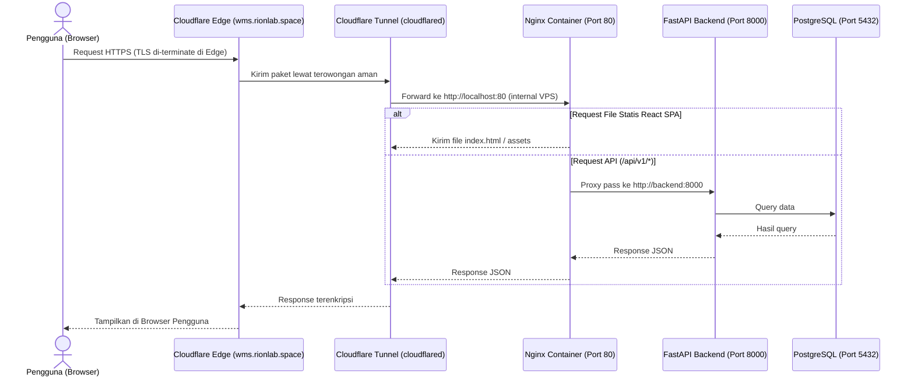

# 01. Arsitektur Server & Alur Ingress

Halaman ini menjelaskan rancangan arsitektur sistem dan alur keamanan jaringan (*network ingress*) yang diimplementasikan pada lingkungan produksi Gudang Piala Kaltim WMS.

---

## Spesifikasi Infrastruktur Produksi

Sistem ini didesain agar dapat berjalan dengan stabil dan aman pada spesifikasi berikut:

* **Sistem Operasi Host:** Ubuntu Server 24.04 LTS (atau versi LTS terbaru).
* **Virtualisasi:** Docker Engine v25+ & Docker Compose v2+.
* **Web Server & Reverse Proxy:** Nginx (berjalan di dalam container `frontend`) untuk menyajikan berkas statis SPA React, melayani routing URL *Single Page Application*, dan meneruskan permintaan API ke backend.
* **Database:** PostgreSQL 16 (berjalan di dalam container `db`).
* **Ingress Jaringan:** Cloudflare Zero Trust Tunnel (`cloudflared`).

---

## Alur Trafik Masuk (Network Ingress Flow)

Sistem ini menggunakan metode **Zero Trust Tunnel** untuk menerima lalu lintas data dari domain **`wms.rionlab.space`**. Dengan metode ini, **tidak ada port publik (seperti 80 atau 443) yang dibuka pada router atau firewall VPS**. Server VPS hanya melakukan koneksi outbound (keluar) secara aman ke Cloudflare Edge.

Berikut adalah diagram visual alur trafik data dari pengguna hingga ke database:

---

## Manajemen Penyimpanan Data (Persistence Strategy)

Kontainer Docker bersifat *ephemeral* (data di dalamnya akan hilang jika kontainer dibuat ulang). Oleh karena itu, data sensitif disimpan menggunakan **Named Volumes** yang terpasang (*mounted*) ke sistem file host:

1. **Volume Database (`postgres_data_prod`):**
   * Menyimpan berkas data biner PostgreSQL.
   * Terpasang di `/var/lib/postgresql/data` di dalam kontainer `db`.
2. **Volume Gambar Unggahan (`uploads_data_prod`):**
   * Menyimpan berkas foto barang yang diunggah oleh pengguna melalui aplikasi.
   * Terpasang di `/app/uploads` di dalam kontainer `backend`.
   * Ini memastikan semua foto produk tetap aman saat kontainer backend diperbarui atau di-restart.
