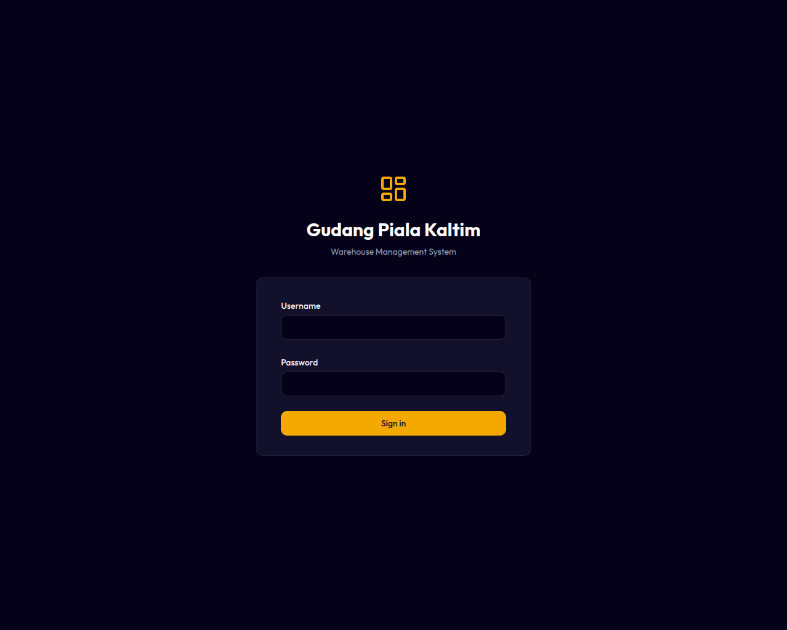

# 01. Login & Manajemen Kata Sandi

Modul ini menjelaskan cara pertama kali mengakses sistem WMS, aturan pembuatan dan penulisan nama pengguna (username), serta tata cara pengelolaan kata sandi (password) baik secara mandiri maupun melalui Super Admin.

---

## Cara Mengakses Aplikasi

Aplikasi WMS Gudang Piala Kaltim dapat diakses melalui browser di HP, tablet, maupun komputer pada alamat:
🌐 **[wms.rionlab.space](https://wms.rionlab.space)**

---

## Aturan Penamaan Pengguna (Username)

Untuk meminimalkan kesalahan login akibat huruf besar/kecil (case sensitivity), sistem menerapkan aturan ketat pada `username`:
* Hanya boleh menggunakan **huruf kecil (a-z)**, **angka (0-9)**, titik (`.`), garis bawah (`_`), dan tanda hubung (`-`).
* **Tidak diperbolehkan menggunakan spasi.**
* **Input Otomatis:** Saat Anda mengetik di kolom username pada halaman Login atau formulir tambah pengguna, sistem akan secara otomatis mengubah huruf menjadi kecil dan menghapus spasi yang tidak sengaja terinput.

---

## Langkah-Langkah Login

1. Buka browser Anda dan kunjungi **[wms.rionlab.space](https://wms.rionlab.space)**.
2. Masukkan **Nama Pengguna (Username)** yang telah didaftarkan.
3. Masukkan **Kata Sandi (Password)** Anda.
4. Klik tombol **Login**.

*Gambar 1.1: Tampilan Halaman Login*

---

## Mengubah Kata Sandi Mandiri

Setiap pengguna yang telah masuk ke dalam sistem dapat mengubah kata sandinya masing-masing demi keamanan:
1. Klik menu **Pengaturan** atau ikon **Profil** di pojok kanan atas/sidebar.
2. Pilih opsi **Ganti Password** / **Ubah Sandi**.
3. Masukkan **Password Lama** Anda untuk verifikasi keamanan.
4. Masukkan **Password Baru** yang kuat, lalu ulangi pada kolom konfirmasi.
5. Klik **Simpan**.

> [!WARNING]
> Harap catat dan simpan kata sandi baru Anda di tempat yang aman. Jika Anda lupa kata sandi Anda, sistem tidak memiliki fitur pengiriman email pemulihan (karena merupakan aplikasi internal). Anda harus menghubungi Super Admin untuk melakukan reset kata sandi.

---

## Reset Kata Sandi oleh Super Admin

Jika staf gudang atau kepala cabang lupa kata sandinya:
1. Hubungi **Super Admin** cabang Anda.
2. Super Admin akan masuk ke menu **Master Data ➔ Pengguna**.
3. Cari nama pengguna yang bersangkutan, lalu klik tombol **Reset Password**.
4. Masukkan kata sandi sementara yang baru, lalu klik **Simpan**.
5. Berikan kata sandi baru tersebut ke pengguna terkait agar mereka dapat masuk dan segera mengubahnya kembali secara mandiri.
