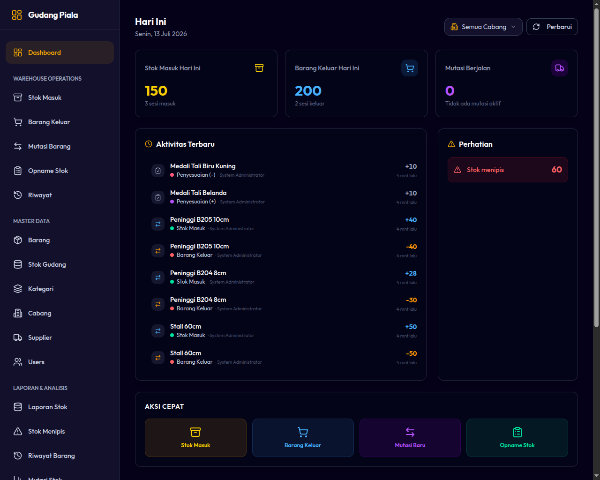

# 02. Navigasi & Fitur Dashboard

Dashboard adalah halaman utama yang pertama kali dilihat oleh pengguna setelah berhasil masuk ke sistem. Halaman ini berfungsi sebagai pusat kesadaran situasional (*situational awareness*) mengenai kondisi gudang secara real-time.

---

## Tampilan Dashboard Berdasarkan Peran

### 1. Super Admin
Menampilkan statistik menyeluruh dari **seluruh cabang** perusahaan (Balikpapan, Samarinda, Bontang):
* **Total Barang (Item Catalog):** Jumlah produk unik yang terdaftar secara global di sistem.
* **Barang Stok Rendah:** Jumlah barang yang stoknya berada di bawah batas minimum (diakumulasikan dari seluruh cabang).
* **Transfer Tertunda:** Daftar pengiriman transfer antar cabang yang masih berstatus `In Transit` dan memerlukan penerimaan oleh cabang tujuan.
* **Ringkasan Stok Cabang:** Tabel/grafik sebaran jumlah total stok fisik di masing-masing cabang.
* **Transaksi Terbaru:** Log aktivitas operasional terakhir (Stock In, Outbound, Transfer) di seluruh sistem.

### 2. Kepala Cabang & Staf Gudang
Menampilkan informasi yang difilter khusus untuk **cabang aktif tempat mereka ditugaskan**:
* **Stok Rendah Cabang Ini:** Indikator barang yang perlu segera dipesan kembali (stok masuk) karena di bawah batas minimum cabang aktif.
* **Transfer Masuk Tertunda:** Daftar kiriman transfer dari cabang lain yang sedang dalam perjalanan menuju cabang aktif.
* **Transaksi Cabang Terbaru:** Riwayat aktivitas logistik khusus di cabang aktif dalam beberapa hari terakhir.

*Gambar 2.1: Tampilan Dashboard WMS (Perspektif Super Admin)*

---

## Indikator Stok Rendah (Low Stock Alert)

Sistem menggunakan data `minimum_stock` yang diset pada data barang untuk mendeteksi barang yang hampir habis:
* **Kondisi:** Jika `Stok Aktif Cabang <= Batas Minimum Barang`, barang tersebut akan masuk ke dalam daftar **Stok Rendah**.
* **Tindakan:** Staf Gudang dapat melihat daftar ini secara rinci di menu Laporan Stok Rendah untuk kemudian mengajukan pengadaan (Stock In) atau melakukan transfer dari cabang lain yang memiliki stok berlebih.

---

## Navigasi Sidebar / Menu Aplikasi

Aplikasi WMS menggunakan menu navigasi samping (sidebar) yang responsif:
* **Dashboard:** Beranda statistik cepat.
* **Inventory (Stok Cabang):** Melihat sisa stok fisik riil di masing-masing cabang.
* **Operations:**
  * **Stock In:** Melakukan penambahan barang dari supplier.
  * **Outbound Cart:** Mengurangi stok untuk penjualan/pesanan pelanggan.
  * **Branch Transfers:** Mengirim dan menerima barang antar cabang.
  * **Stock Opname:** Penyelarasan stok fisik dengan data sistem.
  * **History:** Log operasional harian cabang.
* **Master Data (Khusus Super Admin):** Mengelola barang, kategori, supplier, cabang, dan akun pengguna.
* **Reports & Analytics:**
  * Laporan Stok, Mutasi, Stok Rendah, Selisih Transfer, dan Log Audit.
  * Grafik Analisis Kecepatan Barang dan Kinerja Operator.
