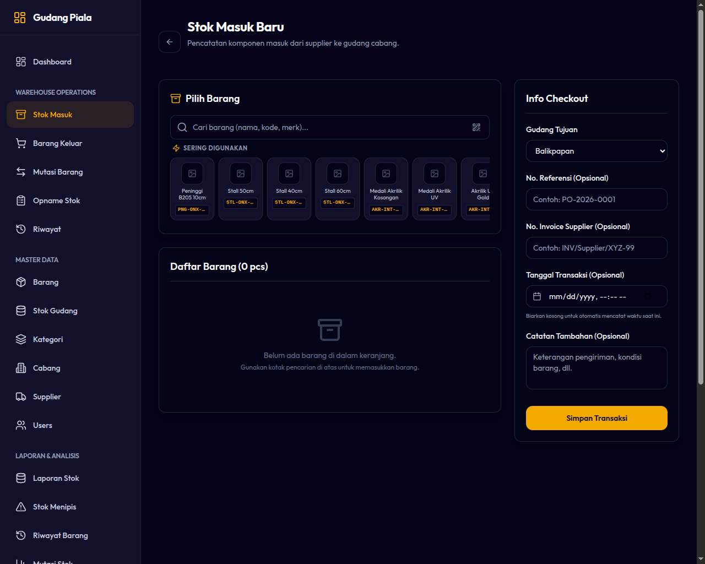

# 04. Alur Penerimaan Barang (Stock In)

Penerimaan Barang (Stock In) adalah proses pencatatan masuknya stok baru ke gudang cabang aktif. Proses ini biasanya dilakukan ketika barang baru tiba dari supplier.

---

## Ketentuan Utama Stock In
* **Batasan Multi-Item:** Anda dapat menambahkan banyak jenis barang sekaligus dalam satu sesi transaksi penerimaan.
* **Perhitungan Transaksi:** Setiap barang yang diinput akan menghasilkan transaksi bertipe `IN` di dalam pembukuan (*ledger*), yang secara otomatis menambah saldo stok cabang terkait.
* **Bebas Nilai Negatif:** Kuantitas barang yang dimasukkan harus berupa bilangan bulat positif yang valid.

---

## Langkah-Langkah Melakukan Stock In

1. Masuk ke aplikasi dan pilih menu **Operations ➔ Stock In**.
2. **Pilih Cabang (Khusus Super Admin):** Jika Anda masuk sebagai Super Admin, tentukan cabang tujuan penerimaan barang. Untuk Staf Gudang dan Kepala Cabang, cabang tujuan akan otomatis terkunci ke cabang asal tugas Anda.
3. **Cari & Pilih Barang:**
   * Masukkan nama barang, kode barang, kategori, atau nama supplier di kolom pencarian.
   * **Atau:** Klik ikon kamera untuk memicu pemindai QR Code di HP/Tablet, lalu scan label QR barang yang tertempel di rak gudang.
   * Klik tombol **Tambah ke Daftar** / klik barang pada hasil pencarian.
4. **Input Kuantitas:** Tuliskan jumlah kuantitas barang fisik yang diterima (dalam satuan PCS).
5. **Tambahkan Barang Lain:** Jika ada beberapa jenis barang yang datang bersamaan dari supplier, ulangi langkah 3 dan 4 untuk barang berikutnya.
6. **Simpan Transaksi:**
   * Periksa kembali seluruh nama barang dan kuantitas di tabel pratinjau.
   * Jika sudah sesuai, klik tombol **Simpan Transaksi (Save)**.
   * Sistem akan memproses data dan memunculkan notifikasi sukses. Stok di cabang tersebut kini langsung bertambah.

*Gambar 4.1: Tampilan Modul Penerimaan Barang (Stock In)*

---

## Pembatalan atau Koreksi Kesalahan Input

> [!CAUTION]
> Transaksi yang sudah disimpan bersifat **permanen dan tidak dapat diedit atau dihapus** dari sistem (untuk mencegah manipulasi logistik).
> Jika Anda melakukan kesalahan ketik (misalnya memasukkan jumlah stok terlalu banyak):
> 1. Jangan mencoba menghapus transaksi.
> 2. Anda harus melakukan transaksi **Outbound** (untuk mengurangi kelebihannya) atau melakukan penyesuaian di menu **Stock Opname** dengan menuliskan catatan alasan koreksi secara jelas (misalnya: "Koreksi kesalahan input transaksi Stock In nomor XYZ").
