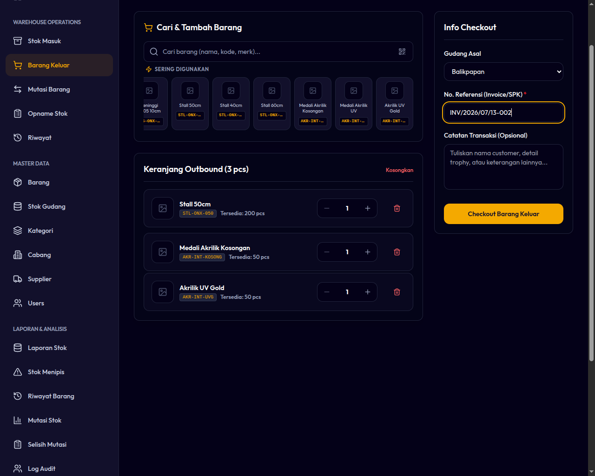

# 05. Alur Pengeluaran Barang (Outbound Cart)

Outbound Cart adalah modul utama untuk mencatat pengurangan stok barang karena digunakan untuk produksi trophy, penjualan produk, atau pengiriman pesanan pelanggan. Modul ini menggunakan alur mirip keranjang belanja kasir (Point of Sales).

---

## Aturan Utama Outbound
1. **Nomor Referensi Wajib (Mandatory Reference):** Setiap transaksi checkout wajib menyertakan nomor referensi dokumen pendukung (seperti Nomor Invoice, Nomor SPK/Order, atau ID Proyek).
2. **Kebijakan Stok Negatif (No Negative Stock):** Sistem **tidak mengizinkan stok bernilai minus**. Jika Anda mencoba mengeluarkan barang melebihi stok yang tersedia di cabang tersebut, proses checkout akan ditolak sepenuhnya.
3. **Penyimpanan Keranjang Lokal (LocalStorage):** Isi keranjang belanja Anda disimpan otomatis di memori browser. Jika tab browser tidak sengaja tertutup atau Anda beralih ke aplikasi lain di HP, isi keranjang tidak akan hilang.

---

## Langkah-Langkah Melakukan Outbound

1. Masuk ke menu **Operations ➔ Outbound**.
2. **Pilih Cabang Aktif:** Pastikan cabang aktif Anda sudah sesuai (Super Admin dapat memilih cabang mana saja).
3. **Tambahkan Barang ke Keranjang:**
   * Cari barang menggunakan kolom pencarian (ketik nama, kategori, supplier, atau kode barang).
   * **Atau:** Pindai kode QR barang dengan kamera HP/Tablet.
   * Pilih barang dari hasil pencarian untuk menambahkannya ke keranjang.
   * Jika barang yang sama ditambahkan lagi, sistem secara otomatis akan menambah kuantitasnya sebanyak 1 unit (tidak membuat baris baru di keranjang).
4. **Sesuaikan Jumlah Barang:** Di dalam tabel keranjang, ketik atau ubah kuantitas pengeluaran masing-masing barang secara manual.
5. **Isi Data Checkout:**
   * **Nomor Referensi (Wajib):** Isi dengan nomor invoice atau proyek (misal: `INV-2026-0098` atau `SPK-SMD-004`).
   * **Catatan (Opsional):** Tambahkan detail peruntukan barang (misal: "Bahan pembuatan 50 piala sepak bola Walikota Cup").
6. **Selesaikan Transaksi (Checkout):**
   * Klik tombol **Checkout**.
   * Jika stok cukup, transaksi sukses dan saldo stok langsung berkurang. Sistem akan mencatat transaksi keluar dengan tipe `OUT` secara otomatis.

*Gambar 5.1: Tampilan Keranjang Pengeluaran Barang (Outbound)*

---

## Penanganan Kasus "Stok Tidak Cukup"

Jika salah satu atau beberapa barang di keranjang memiliki jumlah yang melebihi stok yang tersedia di gudang cabang saat ini:
* Tombol Checkout akan menampilkan peringatan stok tidak cukup, atau proses transaksi akan diblokir dengan pesan kesalahan.
* **Solusi:**
  1. Kurangi jumlah kuantitas di keranjang agar sesuai dengan stok fisik sistem.
  2. Jika stok fisik di gudang sebenarnya ada namun belum diinput ke sistem, lakukan **Stock In** (jika baru datang dari supplier) atau **Stock Opname/Adjustment** (jika terjadi selisih pencatatan) terlebih dahulu.
  3. Lakukan **Transfer Barang** jika stok di cabang Anda habis dan perlu mengambil dari cabang terdekat.
