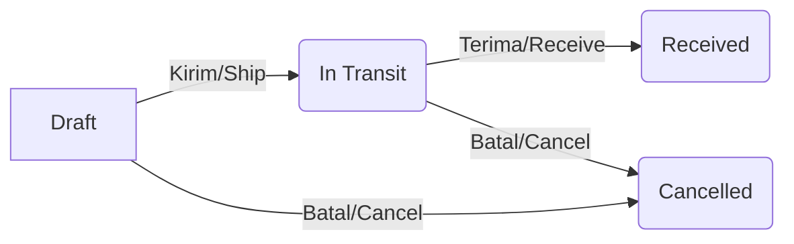
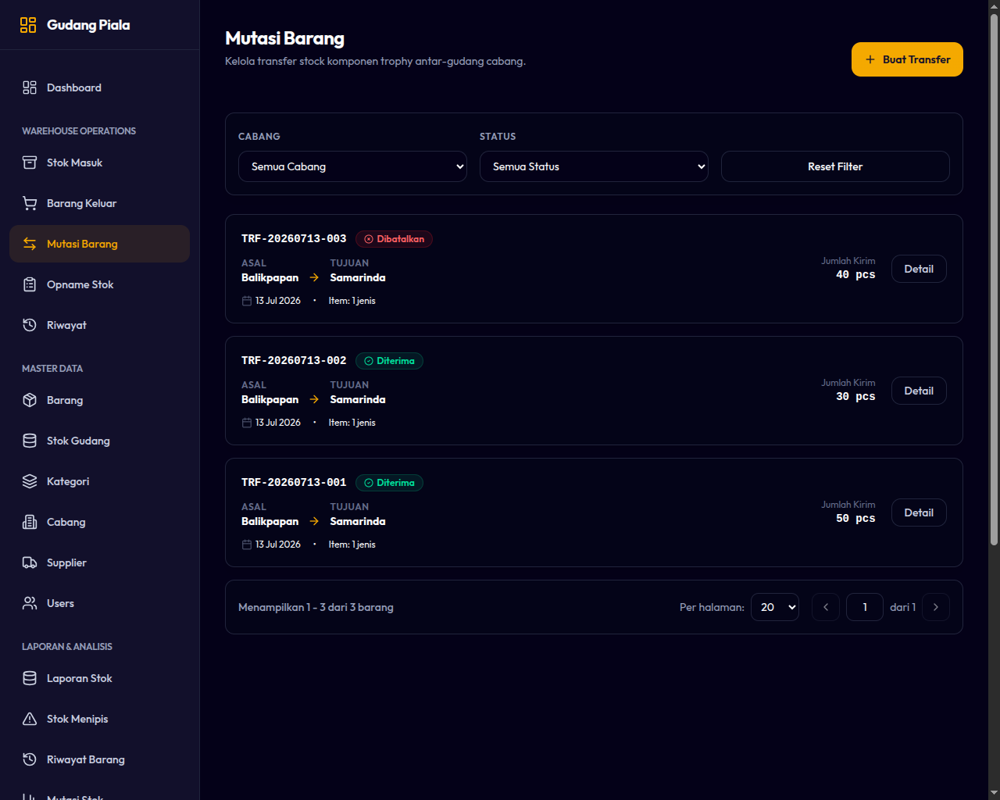
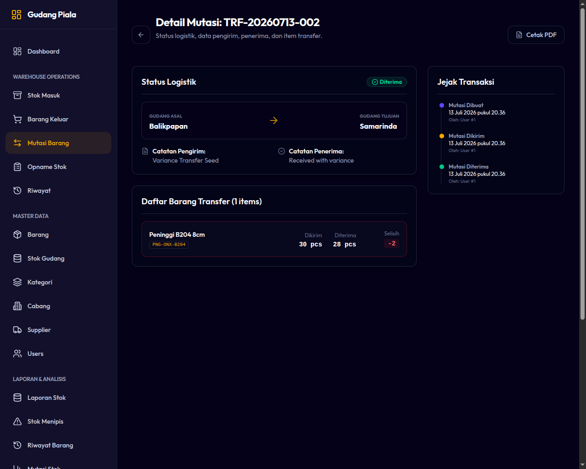

# 06. Alur Transfer Antar Cabang (Branch Transfers)

Modul Transfer Cabang digunakan untuk mendistribusikan barang dari satu cabang ke cabang lainnya (misalnya dari Balikpapan ke Samarinda). Modul ini memiliki alur verifikasi ganda untuk memastikan akurasi jumlah barang selama perjalanan.

---

## 1. Siklus Hidup & Status Transfer

Sistem menggunakan alur status (*state machine*) yang ketat untuk mengontrol perpindahan stok:

* **Draft:** Transfer baru dibuat. Data barang dan jumlah masih bisa diedit. **Belum ada pemotongan stok.**
* **In Transit:** Barang telah dikirim dari cabang asal. **Stok di cabang pengirim langsung dipotong** (`TRANSFER_OUT`) agar tidak bisa dijual/dikeluarkan lagi.
* **Received:** Barang telah sampai dan diterima di cabang tujuan. **Stok di cabang penerima bertambah** (`TRANSFER_IN`). Ini adalah status akhir (*terminal state*) yang tidak bisa diubah kembali.
* **Cancelled:** Transaksi dibatalkan.
  * Jika dibatalkan saat **Draft**, tidak ada efek stok.
  * Jika dibatalkan saat **In Transit**, sistem secara otomatis melakukan jurnal balik untuk **mengembalikan stok ke cabang pengirim**.

---

## 2. Pencatatan Selisih Barang (Transfer Variance)

Saat barang sampai di cabang tujuan, jumlah fisik yang diterima terkadang tidak sama dengan jumlah yang dikirim (misalnya ada barang pecah/rusak di jalan, atau tertukar).

* **Rumus Selisih (Variance):**
  $$\text{Variance} = \text{Jumlah Dikirim} - \text{Jumlah Diterima}$$
* **Kebijakan Selisih:**
  * Penerimaan sebagian (*partial receiving*) diperbolehkan.
  * Jika ada perbedaan antara jumlah dikirim dan diterima (terdapat Variance), **pengguna wajib memilih/menuliskan Alasan Selisih (Variance Reason)** pada baris barang tersebut (misal: "Rusak saat pengiriman", "Kurang kirim dari cabang asal").
  * Selisih ini akan tercatat secara permanen di Laporan Selisih Transfer untuk diaudit oleh manajemen.

---

## 3. Langkah-Langkah Operasional Transfer

### A. Membuat & Mengirim Transfer (Cabang Pengirim)
1. Buka menu **Operations ➔ Transfers**.
2. Klik tombol **Buat Transfer Baru (New Transfer)**.
3. Tentukan **Cabang Penerima (Destination Branch)**.
4. Cari barang dan masukkan jumlah kuantitas yang ingin dikirimkan.
5. Klik **Simpan sebagai Draft** (jika masih ingin mengedit nanti) atau klik **Kirim Barang (Ship)** untuk langsung mengubah status menjadi **In Transit**.

*Gambar 6.1: Formulir Pembuatan Transfer Antar Cabang*

### B. Menerima Transfer (Cabang Penerima)
1. Kepala Cabang penerima masuk ke menu **Operations ➔ Transfers**.
2. Cari transfer yang berstatus **In Transit** (berwarna kuning/oranye).
3. Klik tombol **Terima Transfer (Receive)** pada baris data tersebut.
4. Sistem akan menampilkan daftar barang kiriman. Periksa kondisi fisik barang yang datang:
   * Isi kolom **Jumlah Diterima** sesuai jumlah fisik yang Anda terima dengan baik.
   * Jika jumlah diterima kurang dari jumlah dikirim, kolom **Alasan Selisih** akan muncul secara otomatis. Pilih atau isi alasan selisihnya.
5. Klik tombol **Selesaikan Penerimaan (Complete Transfer)**. Stok cabang Anda sekarang resmi bertambah.

*Gambar 6.2: Halaman Verifikasi Penerimaan Barang Transfer*
