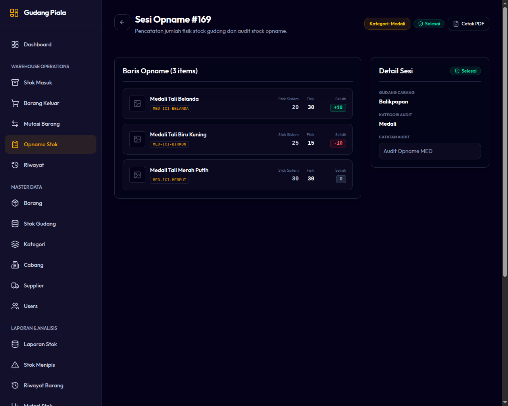

# 07. Penyesuaian Stok Fisik (Stock Opname)

Stock Opname adalah proses berkala untuk mencocokkan jumlah stok fisik yang ada di gudang nyata dengan jumlah stok yang tercatat di sistem WMS. Proses ini krusial untuk menemukan dan mengoreksi kebocoran stok, kerusakan barang, atau kesalahan pencatatan.

---

## Karakteristik Modul Stock Opname
* **Cakupan Kategori:** Stock Opname dilakukan per **Kategori Barang** pada cabang aktif Anda. Ini memungkinkan Anda melakukan opname secara bertahap tanpa harus menutup seluruh operasional gudang.
* **Jurnal Penyesuaian Otomatis:** Ketika Stock Opname diselesaikan (`Completed`), sistem akan menghitung selisih dan otomatis membuat transaksi penyesuaian:
  * Jika Stok Fisik > Stok Sistem ➔ Menghasilkan transaksi `ADJUSTMENT_PLUS` (Stok Masuk).
  * Jika Stok Fisik < Stok Sistem ➔ Menghasilkan transaksi `ADJUSTMENT_MINUS` (Stok Keluar).
  * Kedua transaksi ini menggunakan tipe referensi khusus `'opname'` untuk memudahkan pelacakan audit.
* **Perhitungan Selisih:**
  $$\text{Selisih (Variance)} = \text{Stok Fisik} - \text{Stok Sistem}$$

---

## Langkah-Langkah Melakukan Stock Opname

1. Masuk ke menu **Operations ➔ Stock Opname**.
2. Klik tombol **Mulai Opname Baru (New Opname)**.
3. Tentukan **Kategori Barang** yang ingin dihitung (misal: *Marmer*).
4. Klik **Mulai Perhitungan**. Sistem akan membuat dokumen berstatus `Draft` dan menampilkan seluruh daftar barang di bawah kategori tersebut beserta kolom input.
5. **Hitung Fisik Barang:** Staf gudang menghitung jumlah fisik barang di rak penyimpanan.
6. **Input Stok Fisik:** Masukkan angka hasil hitungan fisik Anda ke dalam kolom **Jumlah Fisik**.
   * Sistem akan otomatis menghitung selisih secara real-time.
   * Jika fisik sama dengan sistem, selisih bernilai `0`.
7. **Simpan Sementara / Selesaikan:**
   * Jika proses perhitungan belum selesai (misalnya jam kerja berakhir), klik **Simpan sebagai Draft** agar Anda dapat melanjutkannya esok hari.
   * Jika seluruh barang dalam kategori tersebut sudah dihitung dan data sudah benar, klik tombol **Selesaikan Opname (Complete)**.

*Gambar 7.1: Formulir Input Hasil Fisik Stock Opname*

---

> [!IMPORTANT]
> **Peringatan Penting Selama Opname:**
> * Sangat disarankan untuk melakukan Stock Opname saat gudang sedang **tidak melakukan aktivitas bongkar muat** (misalnya di luar jam operasional atau akhir pekan).
> * Jika ada transaksi Stock In atau Outbound yang diselesaikan saat dokumen Opname masih berstatus `Draft`, hal tersebut dapat mengakibatkan selisih perhitungan sistem menjadi tidak akurat karena jumlah "Stok Sistem" terkunci saat dokumen Opname dibuat.
