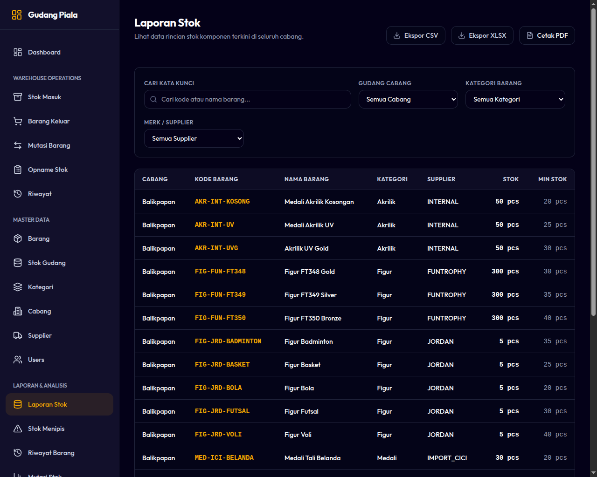
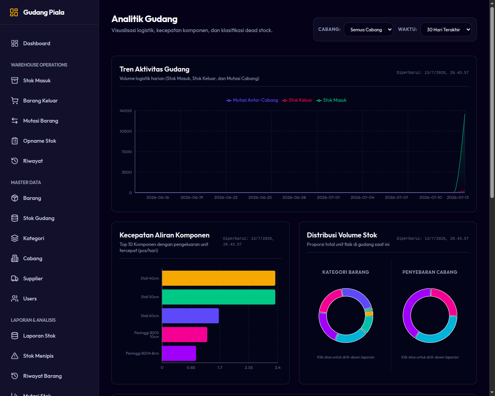

# 08. Laporan Kinerja & Analitik

Menu Reports & Analytics menyediakan data komprehensif bagi pemilik bisnis, manajemen, dan Kepala Cabang untuk mengevaluasi aktivitas logistik, memantau kesehatan persediaan, dan merencanakan pengadaan barang.

---

## 1. Modul Laporan (Reports)

Sistem menyediakan tujuh jenis laporan operasional. Pengguna dapat memfilter data berdasarkan tanggal, kategori, atau supplier sebelum mengekspornya.

### Jenis-Jenis Laporan:
1. **Laporan Stok Saat Ini (Current Stock Report):** Menampilkan sisa persediaan fisik real-time di cabang terkait.
2. **Laporan Mutasi Barang (Inventory Movement Report):** Menampilkan kartu stok barang (saldo awal, masuk, keluar, transfer, saldo akhir) selama periode tertentu.
3. **Laporan Stok Rendah (Low Stock Report):** Daftar barang yang kuantitasnya di bawah batas minimum dan harus segera dipesan ulang.
4. **Laporan Penyesuaian Stok (Stock Adjustment Report):** Riwayat perubahan stok manual hasil koreksi atau Stock Opname.
5. **Laporan Transfer (Transfer Report):** Rekap detail pengiriman antar cabang lengkap dengan kolom Kuantitas Kirim, Kuantitas Terima, dan Selisih (Variance).
6. **Laporan Penggunaan Barang Keluar (Outbound Usage Report):** Rekapitulasi pengeluaran barang berdasarkan Nomor Referensi (Invoice/Proyek).
7. **Laporan Log Audit (Audit Log Report):** Catatan keamanan sistem yang melacak aktivitas teknis user.

### Fitur Unduh PDF
* Seluruh laporan dapat diekspor secara instan ke dalam format berkas **PDF** yang rapi, profesional, dan siap cetak dengan mengklik tombol **Ekspor PDF** di bagian kanan atas halaman laporan.
* **PENTING:** Ekspor PDF hanya akan mencantumkan data yang saat ini sedang aktif difilter di layar (bukan mengekspor seluruh database secara acak).

*Gambar 8.1: Halaman Filter dan Hasil Laporan Stok*

---

## 2. Modul Analisis Bisnis (Analytics Dashboard)

Halaman Analitik menyajikan data dalam bentuk grafik visual interaktif untuk membantu pengambilan keputusan strategis secara lebih cepat.

### Grafik Utama yang Tersedia:
* **Kecepatan Perputaran Barang (Movement Velocity):** Mengidentifikasi barang-barang mana yang paling cepat keluar (fast-moving) versus barang yang menumpuk di gudang.
* **Peringkat Aktivitas Operator:** Grafik kontribusi staf gudang dalam melakukan input transaksi (membantu evaluasi beban kerja staf).
* **Klasifikasi Keaktifan Barang (Movement Classification):**
  * **Aktif (Active):** Barang dengan transaksi keluar/masuk dalam 30 hari terakhir.
  * **Slow Moving:** Barang yang tidak bergerak dalam 31-90 hari terakhir.
  * **Dead Stock (Stok Mati):** Barang yang sama sekali tidak mengalami transaksi pergerakan lebih dari 90 hari.

### Fitur Drill-Down Interaktif
* **Navigasi Klik:** Anda dapat mengklik batang grafik kecepatan barang untuk langsung melompat ke halaman detail barang tersebut.
* **Filter Cepat:** Mengklik irisan diagram lingkaran (pie chart) klasifikasi stok akan menyaring Laporan Stok secara otomatis sesuai dengan klasifikasi tersebut.

*Gambar 8.2: Tampilan Dashboard Analitik Gudang*
