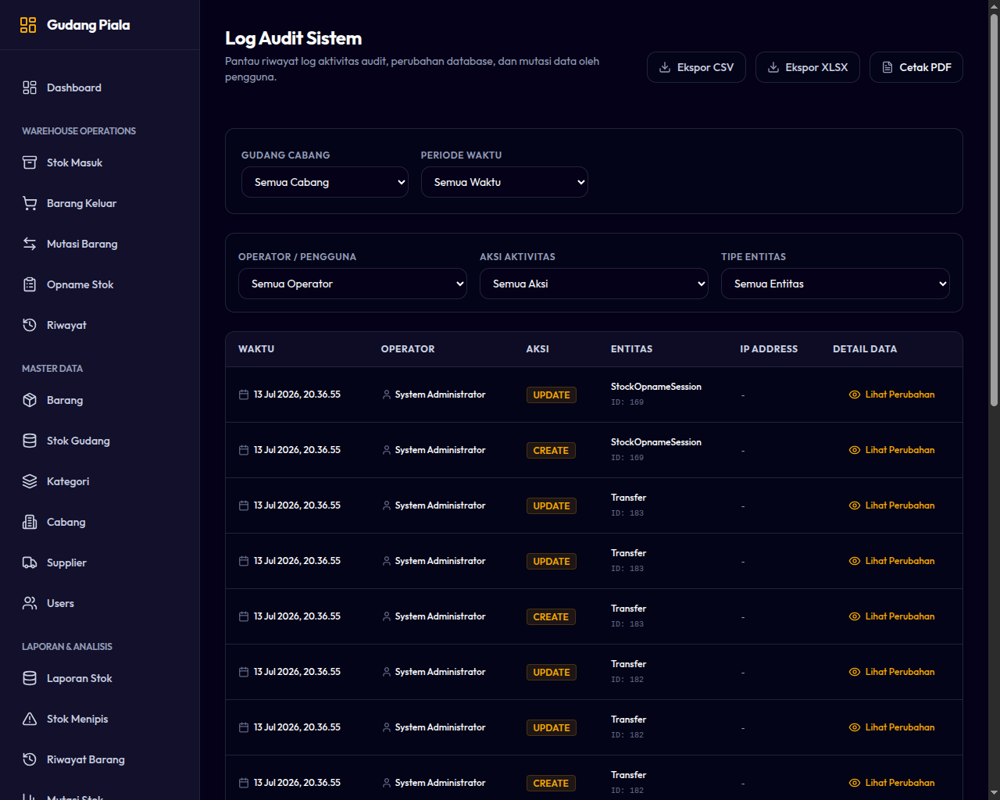

# 09. Pelacakan Log Aktivitas (Audit Logs)

Modul Log Audit adalah fitur keamanan khusus yang hanya dapat diakses oleh **Super Admin** untuk memastikan transparansi total atas seluruh tindakan yang terjadi di dalam sistem WMS.

---

## Prinsip Kepatuhan & Keamanan Data (Compliance)
1. **Kekekalan Data (Immutability):**
   * Log Audit bersifat **hanya-tambah (append-only)**.
   * Tidak ada seorang pun—termasuk pemilik sistem atau Super Admin—yang dapat mengubah (*edit*) atau menghapus (*delete*) baris log audit yang telah terekam.
2. **Rekaman Selisih:**
   * Setiap kali ada perubahan data master atau transaksi inventory, sistem merekam kondisi sebelum (`Old Value`) dan sesudah (`New Value`) tindakan tersebut dilakukan.

---

## Informasi yang Dicatat di Log Audit

Setiap entri log audit mencatat lima parameter utama:
* **Pengguna (User):** Akun pengguna yang melakukan tindakan.
* **Tindakan (Action):** Deskripsi aktivitas yang dilakukan (contoh: `CREATE_ITEM`, `OUTBOUND_CHECKOUT`, `COMPLETE_TRANSFER`, `UPDATE_USER`).
* **Waktu Kejadian (Timestamp):** Tanggal dan jam presisi saat tindakan diproses di server (menggunakan Zona Waktu Jakarta - `Asia/Jakarta`).
* **Nilai Lama (Old Value):** Data sebelum perubahan (berupa teks kosong jika berupa data baru).
* **Nilai Baru (New Value):** Data setelah perubahan disimpan.

---

## Cara Membaca Log Audit

1. Masuk ke halaman **Reports ➔ Audit Logs** (atau melalui menu khusus Log Audit).
2. Gunakan kolom pencarian untuk menyaring berdasarkan **Nama Pengguna** atau kata kunci **Tindakan**.
3. **Penyaringan Tanggal:** Batasi rentang pencarian untuk melacak kejadian pada hari atau jam tertentu saat dicurigai terjadi selisih stok fisik.
4. Klik baris log untuk mengekspansi detail perubahan jika format data cukup panjang (disajikan dalam bentuk teks JSON terstruktur yang mudah dibaca).

*Gambar 9.1: Halaman Daftar Pelacakan Log Audit*
